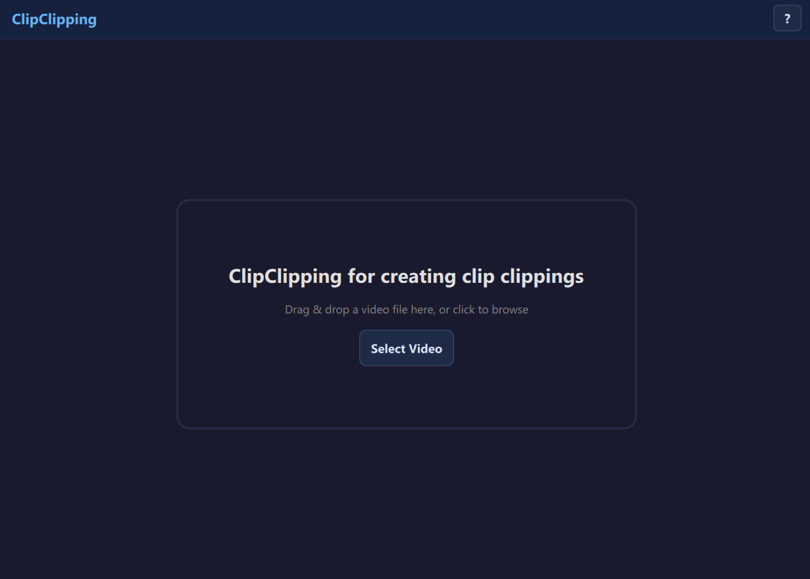
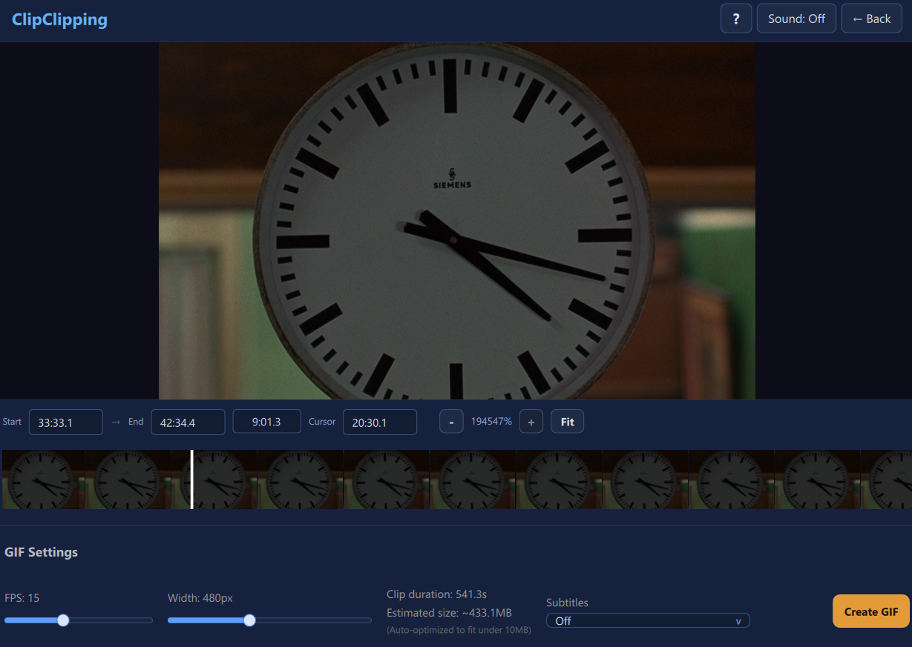

#  ClipClipping

ClipClipping is a desktop app for quickly cutting short moments from videos and exporting them as lightweight GIFs for chats and social media.

Built with Qt 6 + QML, it focuses on a simple flow: open video -> pick start/end -> export -> share.

## About the project

ClipClipping is designed for users who want to create short, shareable clips without learning complex video editors.
It is especially useful for messenger workflows (including Telegram-style GIF usage), where small file size and fast export matter.

## Features

- Open video files from dialog or drag-and-drop.
- Preview and play video directly in the app.
- Select trim range with start/end controls.
- Export to GIF with automatic quality fallback to fit under 10 MB.
- See export progress and cancel long-running jobs.
- Portable packaging support for Windows and Linux builds.

## Screenshots

Project screenshots:




## Quick Start (Linux)

```bash
cmake -S . -B build -DCMAKE_BUILD_TYPE=Release
cmake --build build -j
./build/bin/ClipClipping
```

## Quick Start (Windows)

```powershell
cmake -S . -B build -DCMAKE_BUILD_TYPE=Release -DCMAKE_INSTALL_PREFIX="$PWD/package"
cmake --build build --config Release
cmake --install build --config Release
$windeployqt = "C:\Qt\6.6.3\msvc2019_64\bin\windeployqt.exe"
& $windeployqt --release --force --dir .\package --qmldir .\src\ui --qmldir .\src --qmldir . .\package\bin\ClipClipping.exe
.\package\bin\ClipClipping.exe
```

## Development loop (Windows)

For day-to-day coding, use a separate dev build dir and skip deploy steps:

```powershell
# recommended on this machine (ensures Qt DLLs are found on run)
.\scripts\dev.ps1 -QtPrefix "C:\Qt\6.6.3\msvc2019_64"

# configure once + build Debug
.\scripts\dev.ps1

# if Qt is not in default CMake search paths
.\scripts\dev.ps1 -QtPrefix "C:\Qt\6.6.3\msvc2019_64"

# only build (without auto-run)
.\scripts\dev.ps1 -NoRun

# rebuild from clean CMake cache
.\scripts\dev.ps1 -Reconfigure
```

Notes:

- Script builds target `ClipClipping` into `build` by default.
- After successful build, app starts automatically (disable with `-NoRun`).
- Default config is `Debug` (use `-Config Release` if needed).
- If CMake cannot find Qt6, pass `-QtPrefix` with your Qt kit path.
- If app exits immediately on Windows (missing DLL), run with `-QtPrefix`.
- This is for fast local iteration; `windeployqt` is still needed for portable package output.

Windows build requires Qt runtime deployment (DLLs, plugins, QML modules).
Running `build\...\ClipClipping.exe` directly will usually fail with missing `Qt6*.dll` errors.

For portable usage, place FFmpeg tools into:

- `package\tools\ffmpeg.exe`
- `package\tools\ffprobe.exe`

## Dependencies

- Qt 6.5+ (Core, Gui, Quick, QuickControls2, Multimedia, Concurrent)
- `ffmpeg`
- `ffprobe` (usually shipped with ffmpeg)

## Build

```bash
cmake -S . -B build -DCMAKE_BUILD_TYPE=Release
cmake --build build -j
```

## Run

```bash
./build/bin/ClipClipping
```

If `windeployqt` is not found in `PATH`, use Qt Command Prompt or full path to `windeployqt.exe`
(for example `C:\Qt\6.6.3\msvc2019_64\bin\windeployqt.exe`).

For this project, use `--dir .\package` so QML modules are deployed to `package\qml`
(required by `package\bin\qt.conf` with `Prefix=..`).

If your generator is single-config, build output executable path may be:

```powershell
.\build\bin\ClipClipping.exe
```

but it should still be launched from deployed `package\bin\ClipClipping.exe`.

## Portable package (local)

```bash
cmake --install build --config Release
```

Note: On Windows, Qt deploy scripts require an absolute install prefix.
If needed, pass it explicitly with `--prefix "$PWD/package"`.

Add FFmpeg tools manually into `package/tools`:

- Linux: `package/tools/ffmpeg`, `package/tools/ffprobe`
- Windows: `package/tools/ffmpeg.exe`, `package/tools/ffprobe.exe`

## CI/CD (GitHub Actions)

- `build.yml`: builds portable Linux/Windows bundles on every push/PR and uploads artifacts.
- `release.yml`: on tag `v*` builds portable bundles and publishes them to GitHub Releases.

### Release a new version

```bash
git tag v1.0.0
git push origin v1.0.0
```

After that, release assets are generated automatically:

- `ClipClipping-vX.Y.Z-linux-x86_64.AppImage`
- `ClipClipping-vX.Y.Z-windows-portable.zip`

Linux AppImage and Windows bundle include `ffmpeg` and `ffprobe`.

Run AppImage:

```bash
chmod +x ClipClipping-vX.Y.Z-linux-x86_64.AppImage
./ClipClipping-vX.Y.Z-linux-x86_64.AppImage
```

Local AppImage build helper:

```bash
./scripts/build-appimage.sh
```

Output file:

- `dist/ClipClipping-local-x86_64.AppImage`

Script tries `ffmpeg`/`ffprobe` from `PATH` first.
If they are missing, it downloads a static Linux build automatically into `.cache/ffmpeg`.
It also downloads AppImage tooling (`linuxdeploy`, `appimagetool`) into `.cache/appimage-tools`.

Optionally you can override tool paths:

```bash
FFMPEG_BIN=/usr/bin/ffmpeg FFPROBE_BIN=/usr/bin/ffprobe ./scripts/build-appimage.sh
```

Note for AppImage runtime:

- It defaults to `xcb` platform for better compatibility.
- File picker in AppImage uses Qt dialog (not native DE dialog) to avoid KDE/KIO runtime issues.
